# 🏟️ Sentinel-Runtime Architecture: Policy-Driven Secure AI

This document explains **how** and **why** the Safe Agent Skeleton works. As a fully completed and adversarially-tested runtime, this architecture serves as the definitive reference for its "Safe by Design" implementation.

---

### 🧠 The Core Philosophy: "Safe by Design"
In standard agent builds, the LLM is trusted to act. In our architecture, the **LLM is never trusted.** We treat the agent as a "black box" that produces requests, but the infrastructure (Validator + Runner) has the final say.

```mermaid
flowchart LR
    %% Modern styling with pastel palette
    classDef user fill:#6c5ce7,stroke:#a29bfe,stroke-width:2px,color:#fff,rx:10,ry:10
    classDef attacker fill:#d63031,stroke:#ff7675,stroke-width:2px,color:#fff,stroke-dasharray: 5 5,rx:5,ry:5
    classDef untrusted fill:#ffeaa7,stroke:#fdcb6e,stroke-width:2px,color:#2d3436,rx:10,ry:10
    classDef policy fill:#55efc4,stroke:#00b894,stroke-width:2px,color:#2d3436,rx:10,ry:10
    classDef security fill:#ff7675,stroke:#d63031,stroke-width:2px,color:#fff,rx:10,ry:10
    classDef engine fill:#0984e3,stroke:#74b9ff,stroke-width:2px,color:#fff,rx:10,ry:10
    classDef observability fill:#a29bfe,stroke:#6c5ce7,stroke-width:2px,color:#fff,rx:10,ry:10

    subgraph Inputs ["🎯 Stimulus"]
        direction TB
        User([🧑‍💻 User Prompt]):::user
        RedTeam[🥷 MITRE ATLAS<br/>Attack Lab]:::attacker
    end

    subgraph AgentContext ["🧠 Untrusted Agent Context (Black Box)"]
        direction TB
        Planner[🤖 The Planner<br/>agent/planner.py]:::untrusted
        AgentPlan[/📄 AgentPlan<br/>Proposed Actions/]:::untrusted
        
        Planner -->|Generates| AgentPlan
    end

    subgraph ControlPlane ["🛡️ Safe Runtime: Policy & Validation"]
        direction TB
        Validator{⚖️ Policy Validator<br/>validator/validate.py}:::security
        RiskEngine[📊 Risk Engine<br/>validator/risk.py]:::security
        PolicyDB[(📘 Declarative<br/>Rulebook<br/>policy.yaml)]:::policy
        
        Validator <-->|"Evaluates<br/>w/ Rules"| PolicyDB
        Validator <-->|"Calculates<br/>Score"| RiskEngine
        RiskEngine -.->|"Reads Weights"| PolicyDB
    end

    subgraph ExecutionPlane ["⚙️ Zero-Trust Execution"]
        direction TB
        Runner[⚙️ The Runner<br/>runner/runner.py]:::engine
        HIL{🛑 Human-in-the-Loop<br/>Approval Gate}:::security
        Action[🛠️ OS / Network<br/>Action Executed]:::engine
        
        Runner -->|"High Risk"| HIL
        HIL -->|"Approved"| Action
        Runner -->|"Low/Med Risk"| Action
    end

    subgraph Telemetry ["📈 Observability & Audit"]
        direction TB
        AuditLog[(📝 Immutable<br/>Audit Log<br/>logs/audit.jsonl)]:::observability
        ASOC[📊 ASOC Dashboard<br/>dashboard/app.py]:::observability
        
        AuditLog -->|"Streams"| ASOC
    end

    %% Main Flow Connections
    Inputs --> Planner
    RedTeam -.->|Adversarial<br/>Payloads| Planner
    
    AgentPlan ===>|"Submitted To"| Validator
    Validator ===>|"Passes<br/>Threshold"| Runner
    Action ===>|"Results"| AuditLog
    
    %% Rejection/Audit Flows
    Validator -.->|"Blocked / Critical Risk"| AuditLog
    HIL -.->|"Rejected by Human"| AuditLog
```

---

### �️ Pillar 1: Policy as Code (The Rulebook)
*Found in: `policy/policy.yaml`*

Instead of burying security logic in Python code, we use a **Declarative Security Authority**.
- **Dynamic Risk Weights**: All scoring numbers (network, data sensitivity, step pressure) live in YAML.
- **Admission Control**: Any tool not defined in the "Rulebook" is treated as a `CRITICAL` risk and blocked immediately.
- **Total Authority**: The system posture can be changed instantly without touching a single line of code.

---

### 🧪 Pillar 2: MITRE ATLAS Attack Lab (The Scrimmage)
*Found in: `redteam/harness.py` & `redteam/payloads.py`*

We don't just "hope" the agent is safe; we actively try to break it using the industry-standard **MITRE ATLAS** framework.
- **Adversarial Scenarios**: Automated testing for Prompt Injection (AML.T0054), DNS Exfiltration (AML.T0053), and SSRF.
- **Breach Discovery**: The harness identifies "blind spots" where static rules pass but adversarial intent succeeds.
- **Feedback Loop**: Discoveries in the Attack Lab are used to update the `policy.yaml` (The Rulebook).

---

### 🕹️ The Play-by-Play Flow

1. **The Planner (The Quarterback)**  
   *Found in: `agent/planner.py`*  
   The Agent creates an `AgentPlan`. This is a "Proposed Play."

2. **The Policy Validator (The Referee)**  
   *Found in: `validator/validate.py` & `validator/risk.py`*  
   The Ref checks the `policy.yaml` rulebook:
   - **Risk Score**: Calculated dynamically using YAML weights.
   - **Static Gates**: Prompt injection and network blocklist checks.

3. **The Zero-Trust Runner (The Offensive Line)**  
   *Found in: `runner/runner.py`*  
   Handles execution only after the Ref clears the play. It enforces **Human-in-the-Loop** pauses for any `HIGH` risk action.

---

### 📊 Enterprise Security Gates

| Layer | Component | Security Goal |
| :--- | :--- | :--- |
| **Admission** | `policy.yaml` | 100% Declarative Authority over what is "allowed." |
| **Evaluation** | `risk.py` | Quantitative risk scoring based on enterprise weights. |
| **Verification** | `Attack Lab` | Continual assessment against MITRE ATLAS techniques. |
| **Audit** | `audit.jsonl` | Immutable "Instant Replay" for post-game analysis. |

---

### 🛠️ How to Review Your Progress
- **The Scrimmage (`python -m redteam.harness`)**: See if your current policy can stop a professional-grade attack.
- **The Rulebook Tuning (`policy.yaml`)**: Adjust thresholds and weights to shift the agent's risk tolerance.
- **The Instant Replay (`logs/redteam_summary.json`)**: View the results of the adversarial simulation.
